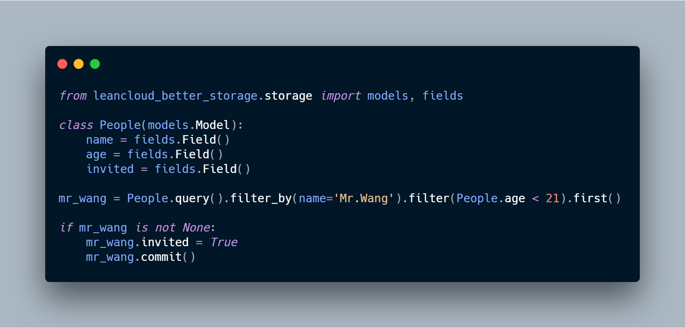

# leancloud-better-storage-python

[](https://badge.fury.io/py/leancloud-better-storage)
[](https://www.travis-ci.com/nnnewb/leancloud-better-storage-python)
[](https://codecov.io/gh/nnnewb/leancloud-better-storage-python)

better leancloud storage wrapper. Simple and lightweight.

> Sorry for my bad grammar and spell :)

## Compatibility

Compatible with Python3.5+ , no Python2 support.

## Installation

install by `easy_install` or `pip`.

```commandline
pip install leancloud-better-storage
```

## Example



## Document

[中文文档](docs/zh-hans.md)可以在这里找到。

[Engligh](docs/en-us.md) version should be coming soon. Contributions are welcome.

## Known limit

Some bulk modification/deletion does not support execute with conditions.
It's limited by leancloud storage service.
For more detail, see document below.

- [python guide - bulk operation](https://leancloud.cn/docs/leanstorage_guide-python.html#hash787692837)
- [CQL guide - update](https://leancloud.cn/docs/cql_guide.html#hash-838846263)
- [CQL guide - delete](https://leancloud.cn/docs/cql_guide.html#hash-1335458389)

## Change log

- 0.1.7 修复初始值 null 覆盖了存储服务生成字段值的问题。
